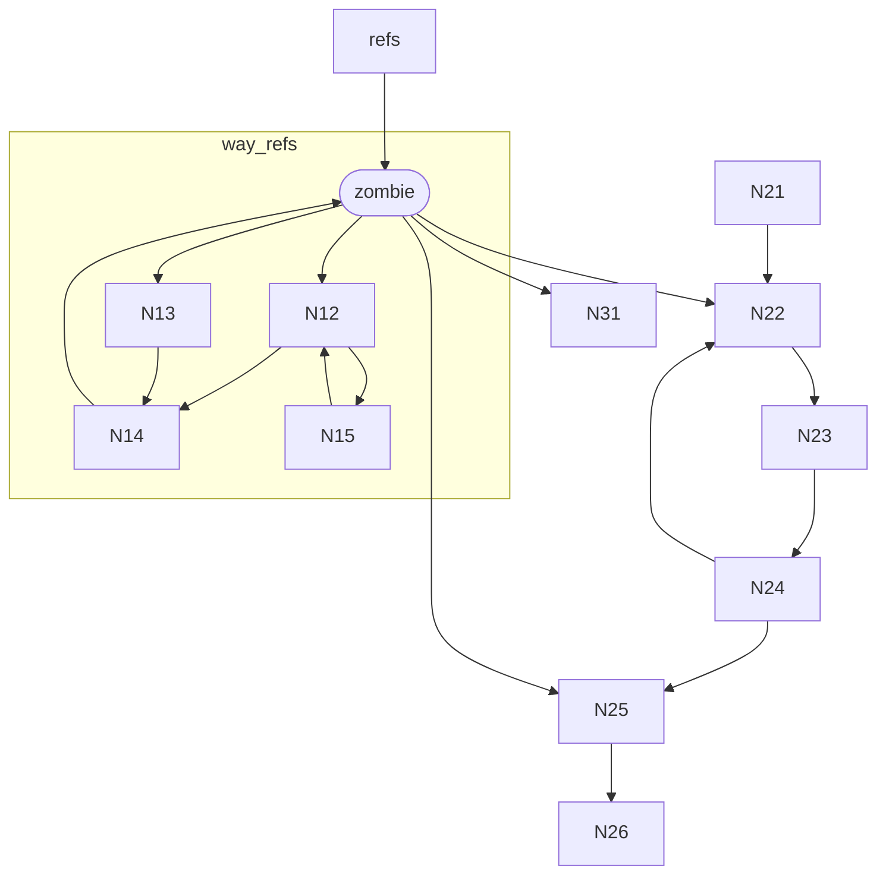
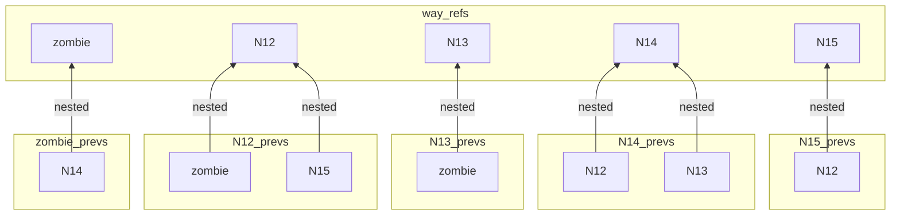

CMAP kernel
===========

## refs

### zombie

```mermaid
flowchart TB
  subgraph way_refs
    N11([zombie])
    N12
    N13
    N14
    N15
  end
  refs --> N11 --> N12 & N13 --> N14 --> N11
  N12 --> N15 --> N12
  N11 & N21 --> N22 --> N23 --> N24 --> N22 & N25
  N11 --> N25 --> N26
  N11 --> N31
```

### refswatcher

```mermaid
flowchart BT
  subgraph way_refs
    zombie
    N12
    N13
    N14
    N15
  end
  subgraph zombie_prevs
    zombie_N14[N14]
  end
  zombie_N14 -- nested --> zombie
  subgraph N12_prevs
    N12_zombie[zombie]
    N12_N15[N15]
  end
  N12_zombie & N12_N15 -- nested --> N12
  subgraph N13_prevs
    N13_zombie[zombie]
  end
  N13_zombie -- nested --> N13
  subgraph N14_prevs
    N14_N12[N12]
    N14_N13[N13]
  end
  N14_N12 & N14_N13 -- nested --> N14
  subgraph N15_prevs
    N15_N12[N12]
  end
  N15_N12 -- nested --> N15
```
