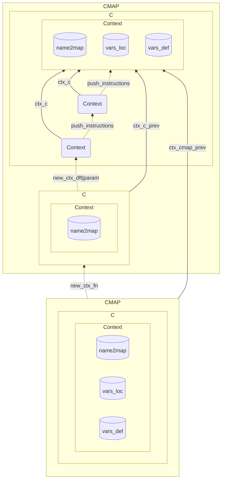
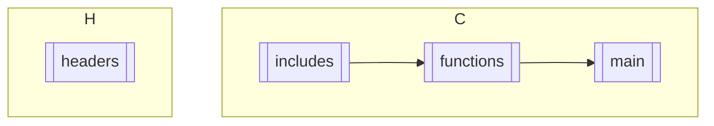

CMAP tool
=========

## Contexts

```mermaid
flowchart BT
  subgraph cmap1 [CMAP]
    subgraph c11 [C]
      subgraph ctx111 [Context]
        name2map111[(name2map)]
        vars_loc111[(vars_loc)]
        vars_def111[(vars_def)]
      end
      ctx112(Context)
      ctx113(Context)
      ctx113 -- ctx_c --> ctx111
      ctx112 -- ctx_c --> ctx111
      ctx112 -. push_instructions .-> ctx111
      ctx113 -. push_instructions .-> ctx112
    end
    subgraph c12 [C]
      subgraph ctx121 [Context]
        name2map121[(name2map)]
      end
    end
    c12 -- ctx_c_prev --> ctx111
    c12 -. new_ctx_dft|param .-> ctx113
  end
  subgraph cmap2 [CMAP]
    subgraph c21 [C]
      subgraph ctx211 [Context]
        name2map211[(name2map)]
        vars_loc211[(vars_loc)]
        vars_def211[(vars_def)]
      end
    end
  end
  cmap2 -- ctx_cmap_prev --> ctx111
  cmap2 -. new_ctx_fn .-> c12
```

## Parts

```mermaid
flowchart TD
  subgraph C
    includes[[includes]]
    functions[[functions]]
    main[[main]]
    includes --> functions --> main
  end
  subgraph H
    headers[[headers]]
  end
```
