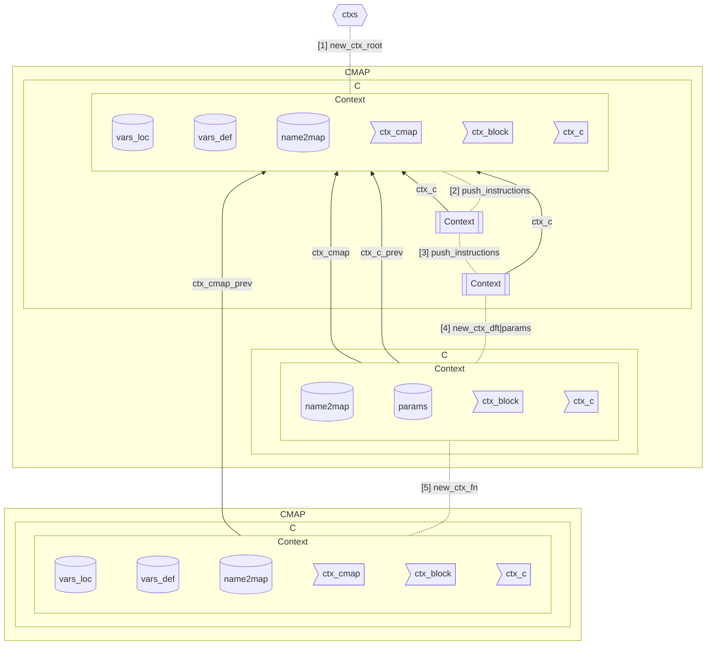
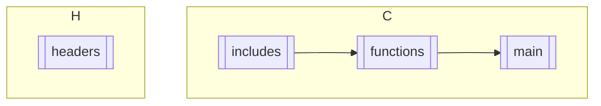

CMAP tool
=========

## Contexts

```mermaid
flowchart BT
  ctxs{{ctxs}}
  subgraph cmap1 [CMAP]
    subgraph c11 [C]
      subgraph ctx111 [Context]
        direction LR
        vars_loc111[(vars_loc)]
        vars_def111[(vars_def)]
        name2map111[(name2map)]
        ctx_cmap111>ctx_cmap]
        ctx_block111>ctx_block]
        ctx_c111>ctx_c]
        vars_loc111 ~~~ vars_def111 ~~~ name2map111 ~~~ ctx_cmap111
        ctx_cmap111 ~~~ ctx_block111 ~~~ ctx_c111
      end
      ctx112[[Context]]
      ctx113[[Context]]
      ctx112 -- ctx_c --> ctx111
      ctx113 -- ctx_c --> ctx111
      ctx112 -. "[2] push_instructions" .- ctx111
      ctx113 -. "[3] push_instructions" .- ctx112
    end
    subgraph c12 [C]
      subgraph ctx121 [Context]
        direction LR
        name2map121[(name2map)]
        params121[(params)]
        ctx_block121>ctx_block]
        ctx_c121>ctx_c]
        name2map121 ~~~ params121 ~~~ ctx_block121 ~~~ ctx_c121
      end
    end
    ctx121 -- ctx_cmap --> ctx111
    ctx121 -- ctx_c_prev --> ctx111
    ctx121 -. "[4] new_ctx_dft|params" .- ctx113
  end
  subgraph cmap2 [CMAP]
    subgraph c21 [C]
      subgraph ctx211 [Context]
        direction LR
        vars_loc211[(vars_loc)]
        vars_def211[(vars_def)]
        name2map211[(name2map)]
        ctx_cmap211>ctx_cmap]
        ctx_block211>ctx_block]
        ctx_c211>ctx_c]
        vars_loc211 ~~~ vars_def211 ~~~ name2map211 ~~~ ctx_cmap211
        ctx_cmap211 ~~~ ctx_block211 ~~~ ctx_c211
      end
    end
  end
  ctx211 -- ctx_cmap_prev --> ctx111
  ctx111 -. "[1] new_ctx_root" .- ctxs
  ctx211 -. "[5] new_ctx_fn" .- ctx121
```

## Parts

```mermaid
flowchart TD
  subgraph C
    includes[[includes]]
    functions[[functions]]
    main[[main]]
    includes --> functions --> main
  end
  subgraph H
    headers[[headers]]
  end
```
